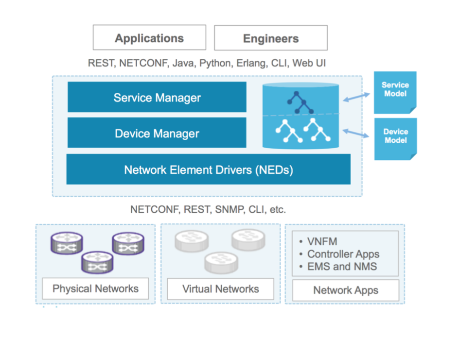

.. Cisco NSO documentation master file, created by
   sphinx-quickstart on Mon Dec  2 16:16:50 2019.
   You can adapt this file completely to your liking, but it should at least
   contain the root `toctree` directive.

Welcome to Cisco NSO documentation!
===================================

Creating and configuring network services is a complex task that often requires multiple configuration changes to all devices participating in the service.

Additionally changes generally need to be made concurrently across all devices with the changes being either completely successful or rolled back to the starting configuration. 

And configuration need to be kept in sync across the system and the network devices. NSO approaches these challenges by acting as interface between people or software that want to configure the network, and the devices in the network.
The key features of NSO that comes into play includes:

#.  Multi-vendor device configuration management using the native protocols of the network devices.

#. A Configuration Database (CDB) managing synchronized configurations for all devices and services in the network domain.

#. A set of northbound interfaces including human interfaces like web UI and a CLI; programmable interfaces including RESTCONF, NETCONF, JSON-RPC; and language bindings including Java, Python and Erlang.

Supported Network Operating Systems:
____________________________________

* Cisco IOS
* Cisco IOS-XR
* Cisco NX-OS
* Juniper JunOS
* Arista EOS
* Over X Vendors Supported

Auto-Parsed Configuration 
=========================

Are you tired of having to create and maintain regular expressions to handle unstructured data in configuration or normalizing data between platforms to make a consistent data model?

Does this look like fun? 

.. code-block:: bash

    \D+\d+((/\d+)+(\.\d+)?)?

Or would you rather have a network automation easy button? Cisco NSO not only **parses all your configuration** into a standard data model, but provides a database of that configuration which is API enabled. It then will keep track of every network change it makes and calculate any rollback needed, no matter how complicated or across many devices. 

It also provides advanced features such as network service orchestration, so you can define your network into managed services and deploy or remove them as needed. It is completely customizable, according to your network's needs. 

Here is an example of the software's built-in CLI, showing a dummy device's configuration, and its parsed values in the Cisco NSO database:

.. code-block:: bash

    admin@ncs# show running-config devices device ios-netsim-0 config ios:router
   devices device ios-netsim-0
    config
     ios:router bgp 64512
      aggregate-address 10.10.10.1 255.255.255.251
    !
    !
    !
    admin@ncs# show running-config devices device ios-netsim-0 config ios:router  | display json
    {
    "data": {
        "tailf-ncs:devices": {
        "device": [
            {
            "name": "ios-netsim-0",
            "config": {
                "tailf-ned-cisco-ios:router": {
                "bgp": [
                    {
                    "as-no": 64512,
                    "aggregate-address": {
                        "address": "10.10.10.1",
                        "mask": "255.255.255.251"
                    }
                    }
                    ]       
                }
            }
            }
        ]
        }
      }
    }
    admin@ncs# show running-config devices device ios-netsim-0 config ios:router | display xml
    <config xmlns="http://tail-f.com/ns/config/1.0">
    <devices xmlns="http://tail-f.com/ns/ncs">
    <device>
        <name>ios-netsim-0</name>
        <config>
        <router xmlns="urn:ios">
            <bgp>
            <as-no>64512</as-no>
            <aggregate-address>
                <address>10.10.10.1</address>
                <mask>255.255.255.251</mask>
            </aggregate-address>
            </bgp>
        </router>
        </config>
    </device>
    </devices>
    </config>

Robust Model-Driven APIs
========================

Lorem Ipsem

NetDevOps-ify Your Existing Brownfield Network
----------------------------------------------

Access or change any device's pre-parsed configuration remotely using the RESTful API:

.. code-block:: bash

    curl -X GET \
    http://127.0.0.1:8080/restconf/data/tailf-ncs:devices/device=ios-netsim-0 \
    -H 'Accept: application/yang-data+json' \
    -H 'Authorization: Basic YWRtaW46YWRtaW4=' \
    -H 'Postman-Token: 4be02b66-7b02-470a-9508-943e40a1bf16' \
    -H 'cache-control: no-cache'

    {
    "tailf-ncs:device": {
        "name": "ios-netsim-0",
        "address": "127.0.0.1",
        "port": 10022,
        ...
            "config": {
            ...
                "community-list": {
                "number-standard": [
                    {
                    "no": 1,
                    "permit": {
                    }
                    },
                    {
            "tailf-ned-cisco-ios:interface": {
                "Loopback": [
                {
                    "name": "0"
                },
                {
                    "name": "100",
                    "description": "Mgmt IP from NSO",
                    "ip": {
                    "address": {
                        "primary": {
                        "address": "10.3.3.3",
                        "mask": "255.255.255.0"
                        }
                    }
                    }
                },
                {
                    "name": "200",
                    "description": "Also Modified By User",
                    "ip": {
                    "address": {
                        "primary": {
                        "address": "10.2.2.5",
                        "mask": "255.255.255.0"
                        }
                    }
                    }
                }
                ],
                "FastEthernet": [
                {
                    "name": "0/0"
                },
                {
                    "name": "1/0"
                },
                {
                    "name": "1/1"
                }
                ]
            },
            "tailf-ned-cisco-ios:spanning-tree": {
                "optimize": {
                "bpdu": {
                    "transmission": false
                }
                }
            },
            "tailf-ned-cisco-ios:router": {
                "bgp": [
                {
                    "as-no": 64512,
                    "aggregate-address": {
                    "address": "10.10.10.1",
                    "mask": "255.255.255.251"
                    }
                }
                ]
            },

A Powerful Python API
---------------------

You can Create, Read, Update or Delete any configuration on any device Cisco NSO manages. For example, this script uses the Cisco IOS data model on a legacy CLI device and prints the precise data requested, no RegEx needed: 

.. code-block:: python

    with ncs.maapi.single_write_trans('admin', 'python') as t:
        root = ncs.maagic.get_root(t)
        device = root.devices.device["ios-netsim-0"].config
        for interface in device.interface["Loopback"]:
            print("This device has interface Loopback {} with a description of {}, and an IP address and mask of {} {}".format(interface.name, interface.description, interface.ip.address.primary.address, interface.ip.address.primary.mask))
    ...
    This device has interface Loopback 0 with a description of None, and an IP address and mask of None None
    This device has interface Loopback 100 with a description of Mgmt IP from NSO, and an IP address and mask of 10.3.3.3 255.255.255.0
    This device has interface Loopback 200 with a description of Also Modified By User, and an IP address and mask of 10.2.2.5 255.255.255.0

.. toctree::
   :maxdepth: 2

   installation/index
   quick_start/index
   python_api/index
